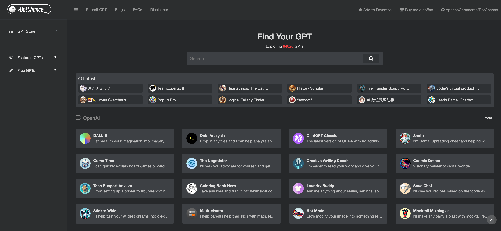

  

<h1 align="center">The Leading Third-Party GPT Store</h1>

## Updates
- 23/12/2023: Added 34,554 new GPTs by OpenAI, totaling 72,294.
- 15/12/2023: Initiated all GPTs, totaling 37,739.

## Welcome

BotChance is a leading third-party GPT store, featuring a compilation of OpenAI, CharacterAI, and POE GPT Agents.

BotChance was created to make it easier for everyone to find and access their favorite GPTs or submit their own creations. 

We developed a dedicated website, [BotChance.com](https://botchance.com), along with this repository, offers an extensive selection of GPT applications for exploration and contribution.

Whether you're in search of your favorite GPTs or eager to submit your own creations, BotChance serves as an accessible and comprehensive platform for all your needs.

## ScreenShot

## Features

### ✅ All GPTs
BotChance includes numerous GPT applications from different platforms:
- OpenAI: [65741] of GPTs. [See all GPTs](./gpt-store/openai.md)
- POE: [5964] of GPTs. [See all GPTs](./gpt-store/poe.md)
- CharacterAI: [589] of GPTs. [See all GPTs](./gpt-store/characterai.md)

### ✅ Latest GPTs
Explore the newest GPTs recently added to BotChance. [Explore now](https://botchance.com)

### 🕒 Featured GPTs (Coming Soon)
Discover our curated selection of featured GPTs that stand out for their unique capabilities and innovative features. [Explore now](https://botchance.com/gpt-tag/featured-gpts)

### 🕒 Free GPTs (Coming Soon)
Explore our range of free GPT applications, perfect for those just starting or looking to experiment with GPT technology. [Explore now](https://botchance.com/gpt-tag/free-gpts)

## How To Submit GPTs
We welcome users to submit new GPT applications. If you know of or own a GPT application not listed on our site, you can submit the information through [Submit GPT](https://botchance.com/submit-gpt) form, and your GPT will be officially add to BotChance after passing a security review.

## Project Maintenance
This project is proudly maintained by Apache Commerce. We strive to keep BotChance updated and responsive to the community's needs.

## Support Us
Love what we're doing? Buy us a coffee and show your support! Your contributions help us maintain and improve this project. [Buy me a Coffee](https://buy.stripe.com/3cs5ob8Zj8vy8fu9AA)

## Acknowledgements
Special thanks to all contributors and users of BotChance. Your support and feedback make this project possible.

## License
This project is licensed under the [MIT License](LICENSE).